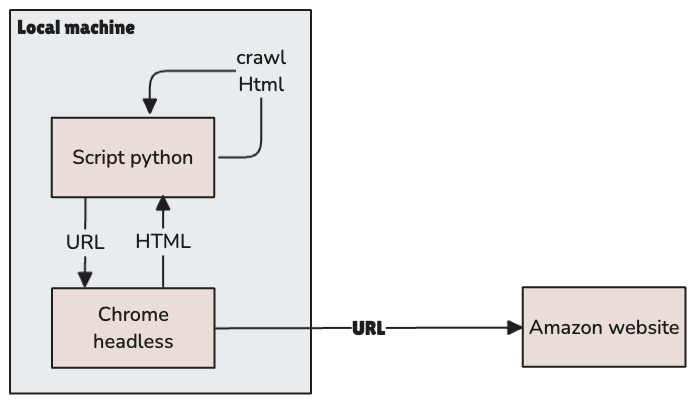

# 🛒 Amazon Product Price Scraper (CLI)
Ce projet est un outil en ligne de commande permettant de récupérer les informations de prix d’un produit Amazon à partir de son URL. Il extrait le prix actuel, les éventuelles promotions, ainsi que d'autres détails utiles du produit.



🔧 Fonctionnalités :
- Récupération du prix actuel et du prix promotionnel (si disponible)
- Extraction à partir d’une seule URL produit Amazon
- Utilisation simple via la ligne de commande
- Résultats affichés directement dans le terminal

📦 Technologies utilisées :
- Python
- Requests
- BeautifulSoup
- Webdriver

## Développement en local :
Installer le plugin Vs Code "Excalidraw".

Install `virtualenv` if dosen't exist :
```shell
pip install virtualenv
```

```shell
python -m venv venv.nosync
source venv.nosync/bin/activate
pip install -r requirements.txt
```

## Exécution :
### Help :
```shell
(venv.nosync) % python ./main.py --help                                    
usage: main.py [-h] [--url URL_FLAG] [--debug] [url]

Récupère le prix d'un article Amazon

positional arguments:
  url             URL de la page produit Amazon

options:
  -h, --help      show this help message and exit
  --url URL_FLAG  URL de la page produit Amazon (alternative)
  --debug         Mode debug: affiche tous les prix trouvés sur la page

Exemples d'utilisation:
  python main.py https://www.amazon.fr/dp/B0DCBB2YTR
  python main.py "https://www.amazon.fr/dp/B0DCBB2YTR?th=1"
  python main.py --url "https://www.amazon.fr/dp/B0DCBB2YTR?th=1"
  python main.py --debug "https://www.amazon.fr/dp/B0DCBB2YTR?th=1"
```
### Examples :
#### Sans promotion
```shell
(venv.nosync) % python ./main.py "https://www.amazon.fr/dp/B0DCBB2YTR?th=1"
============================================================
🔍 Scraper de prix Amazon avec Selenium
============================================================
URL: https://www.amazon.fr/dp/B0DCBB2YTR?th=1

Chargement de la page...
Zone de recherche limitée à #centerCol
Prix actuel trouvé: 99

============================================================
📊 RÉSULTATS
============================================================

💰 Prix actuel: 99.00 €

ℹ️  Pas de promotion détectée

============================================================
```

#### Avec promotion
```shell
(venv.nosync) % python ./main.py "https://www.amazon.fr/dp/B0BJQ7F16T"
============================================================
🔍 Scraper de prix Amazon avec Selenium
============================================================
URL: https://www.amazon.fr/dp/B0BJQ7F16T

Chargement de la page...
Zone de recherche limitée à #centerCol
Prix actuel trouvé: 59
Prix original trouvé: 82,17€ (sélecteur: .basisPrice .a-price[data-a-strike="true"] .a-offscreen)
Réduction trouvée: -27 %

============================================================
📊 RÉSULTATS
============================================================

💰 Prix actuel: 59.00 €
🏷️  Prix original: 82.17 €
🎉 Réduction: -27%

✨ Ce produit est EN PROMOTION ! ✨

============================================================
```

## En cas d'erreur avec webdrive :
```shell
# Supprimer le cache corrompu
rm -rf ~/.wdm
# Réinstaller
pip install --upgrade webdriver-manager
```

## Thanks to
Vibecoding via Claude AI & enimiste

## ⚠️ Disclaimer
Ce projet est à but éducatif. Pour un usage conforme aux conditions d’Amazon, il est recommandé d’utiliser leur API officielle.